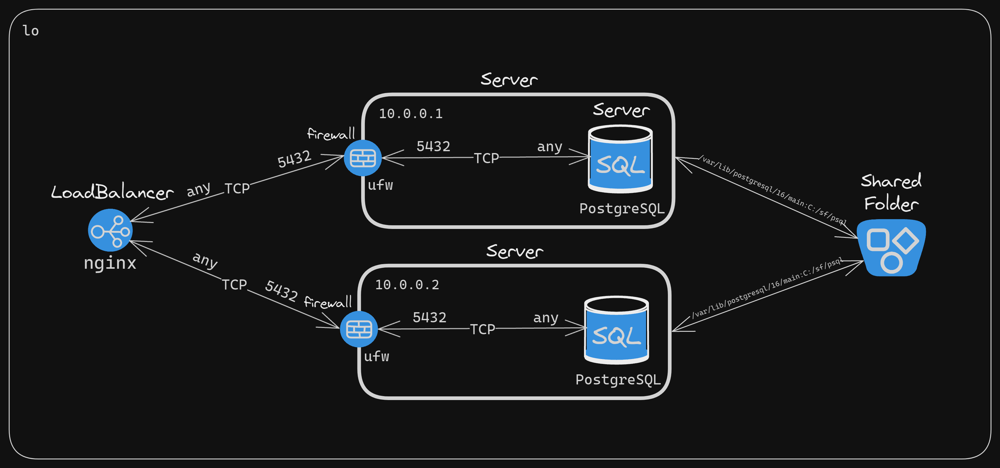

# PostgreSQL HA Infrastructure Documentation

## Overview

This documentation outlines the network architecture for a high-availability web application. The architecture employs a load balancer, multiple web servers, PostgreSQL databases, and a shared storage solution to ensure scalable and reliable access to the application.

## Components

### Load Balancer
- **IP Addresses:** 11.0.0.1
- **Type:** nginx
- **Function:** Distributes incoming TCP traffic across multiple servers to optimize resource utilization and maximize throughput.
- **Configuration:** Accepts any incoming TCP traffic, indicating flexibility in handling different types of requests.

### Servers
- **IP Addresses:** 10.0.0.1, 10.0.0.2
- **Function:** Hosts the web application, handling web requests, application logic, and API endpoints.
- **Security:** Each server is protected by ufw (Uncomplicated Firewall), configured to permit traffic on TCP port 5432 only.

### Firewall
- **Component:** ufw (Uncomplicated Firewall)
- **Rules:** Allows traffic on TCP port 5432, which is used by PostgreSQL. This restricts server access to database-related traffic for security.

### PostgreSQL Databases
- **Port:** 5432
- **Function:** Stores and manages SQL data for the web application.
- **Security:** Listens for TCP traffic on port 5432, ensuring that only requests from authorized sources reach the database.

### Shared Folder
- **Path:** /var/lib/postgresql/16/main/c:/sf/psql
- **Function:** Provides a common storage area for both databases, potentially used for replication, backups, or storing shared assets.

## Networking Details
- **Internal Network:** lo (localhost)
- **Communication:** Components are likely hosted within the same local network or data center, facilitating fast and secure communication.

